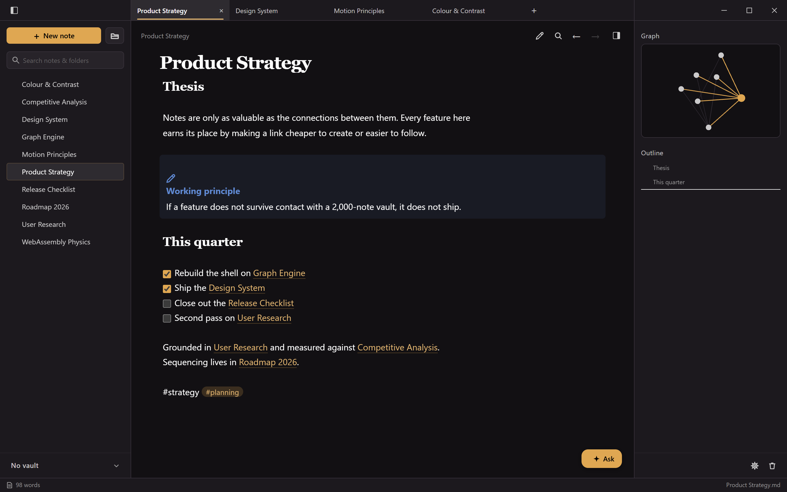
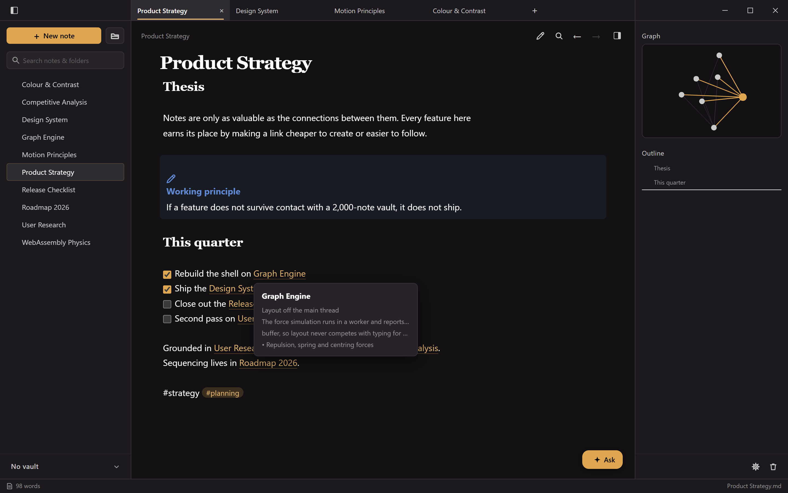
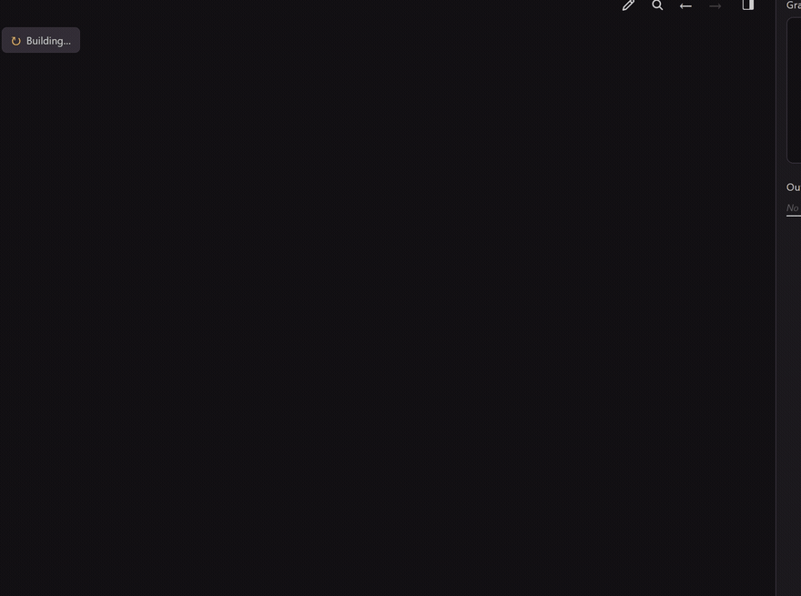
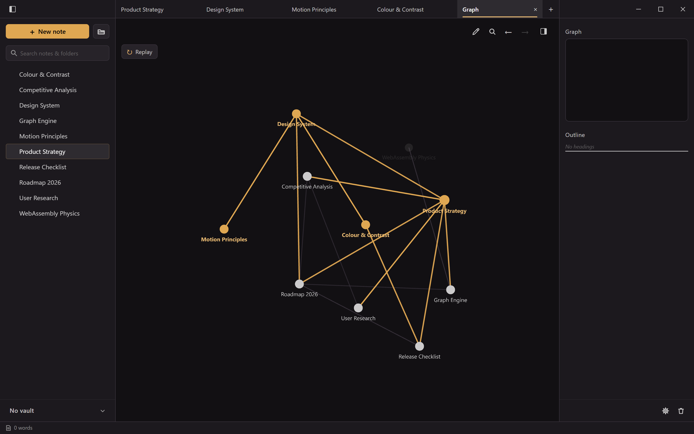
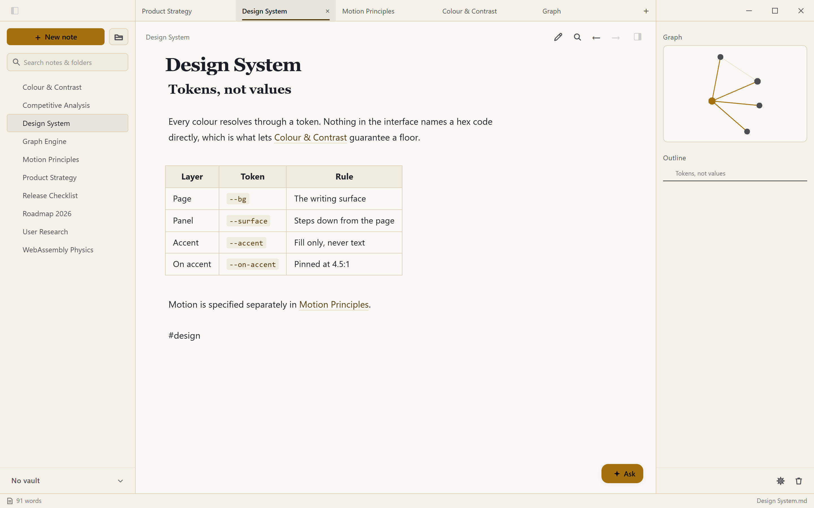
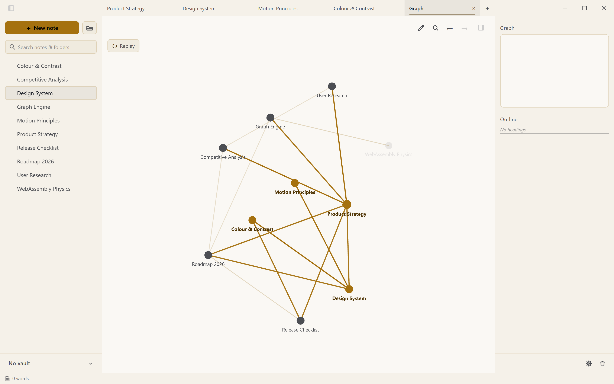
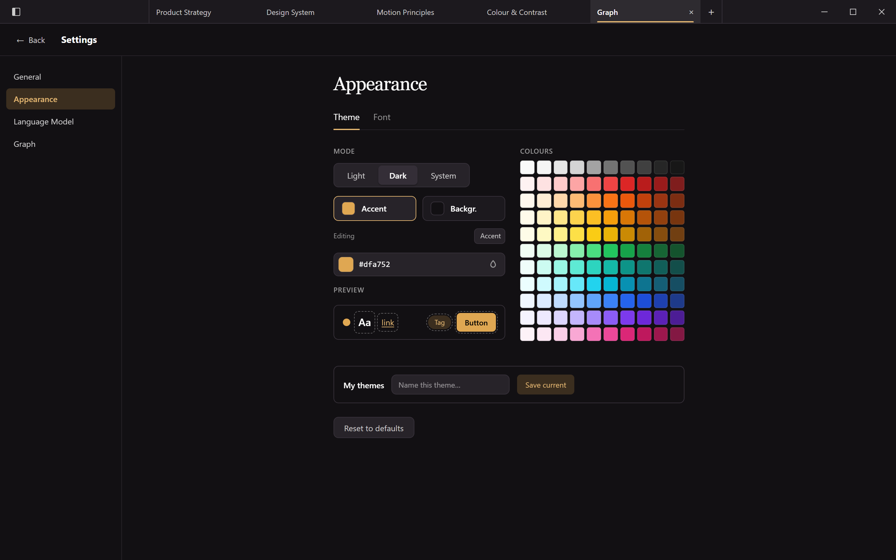

<div align="center">

# HyperLinkNotes

**A local-first notebook where the links between notes are the primary interface.**

A live force-directed graph of your vault, an Obsidian-style live-preview Markdown
editor, and an assistant that reads your notebook — in a native desktop app that
keeps every note as a plain `.md` file on your disk.

[](https://github.com/akshay-env/Hyper-notes/releases/latest)

[](LICENSE)
[](https://tauri.app)
[](https://www.rust-lang.org)
[](https://solidjs.com)
[](https://webassembly.org)
[](#install)



</div>

---

## The idea

Most note apps treat links as decoration and the graph as a screensaver. This one
inverts that: **a link is the cheapest thing you can make, and the graph is a place
you actually navigate.**

Type `[[Design System]]` and the link resolves as you write. Hover it to read the
target without leaving the page. Click it to go there — or click one that doesn't
exist yet, and the note is created.

<div align="center">

</div>

A link can also carry several destinations. `[[Design System|Motion Principles]]`
is one link to two notes — hovering offers both rather than forcing you to pick
at writing time.

---

## The graph is a real view

Every note is a node, every wikilink an edge. The layout is a force simulation —
repulsion, springs and centring, with a cooling schedule you can reheat by
dragging a node.

<div align="center">

<br><em>The simulation settling — replayed live, not a rendered animation.</em>
</div>

It runs in a **WebAssembly kernel on a worker thread**, reporting positions back
through a shared buffer. Layout never competes with typing for frames, which is
what keeps it usable at a couple of thousand notes instead of becoming a party
trick that stutters.

The graph is a tab, not a modal — it sits alongside your notes, and a live
mini-graph of the current note's neighbourhood stays in the side panel while you
write.

<div align="center">

</div>

---

## Write in Markdown, read as you go

Headings, tasks, callouts, tables, math, tags and images render inline while the
raw Markdown stays one cursor-move away. Three modes: **live preview**, **source**
and **reading**.

<div align="center">

| Light | Dark |
| :---: | :---: |
|  |  |
|  |  |

<em>The graph is themed from the same tokens as the editor — it is not a fixed palette.</em>

</div>

---

## Make it yours

Mode, accent, background, font, and per-element colour overrides for buttons,
tags, links and headings — saveable as named themes.

<div align="center">

</div>

Themes aren't a skin over fixed colours. Every surface, border, text tier and
graph colour is **derived** from a background/accent pair, so a change recolours
the whole app coherently.

The catch with generated themes is that a user can pick a combination that makes
something invisible. So the derivation is tested: the suite walks every
background/accent pair the editor can produce and asserts each token still clears
its contrast floor — **220,943 combinations**, no token below its ratio.

---

## Your notes stay yours

A vault is a plain folder of `.md` files. No account, no sync service, no
telemetry, and nothing to log into.

API keys for the assistant are held in the **Windows credential store** and are
**write-only to the interface**: the app can save a key but can never read one
back, and every model request is made from the Rust backend. Bring your own key —
Anthropic, Gemini, OpenAI, or any OpenAI-compatible endpoint.

---

## Install

Download the latest Windows x64 installer from the **[Releases page](https://github.com/akshay-env/Hyper-notes/releases/latest)**.

> [!NOTE]
> The app renders through the Microsoft Edge **WebView2** runtime, preinstalled on
> Windows 11 and current Windows 10. The installer fetches it if it's missing.

> [!IMPORTANT]
> The installer is not code-signed, so SmartScreen will warn on first run.
> Choose **More info → Run anyway**.

---

## How it's built

| Layer | Choice | Why |
| --- | --- | --- |
| Shell | Rust + Tauri 2 | Native window, no bundled browser runtime |
| Interface | SolidJS | Fine-grained reactivity, no virtual DOM diffing on every keystroke |
| Editor | CodeMirror 6 | Live preview built as decorations over the real document |
| Graph layout | AssemblyScript → WebAssembly | The O(n²) repulsion pass, off the main thread |
| Graph rendering | PixiJS (WebGL) | Thousands of nodes without per-frame DOM work |
| Backend | Rust | Vault filesystem, model calls, OS keychain |

A few decisions worth calling out:

- **The physics kernel has two implementations.** The WebAssembly path is the fast
  one; a JavaScript path is the fallback. The test suite asserts they agree, so
  the fallback can't silently rot.
- **Tailwind owns geometry, not colour.** Utilities handle flex, grid and spacing;
  every colour resolves through the app's own tokens, so no utility can bypass the
  contrast floor.
- **Motion has one vocabulary.** Three durations, one decelerate curve, no
  overshoot anywhere — and `prefers-reduced-motion` collapses all of it.

### Build from source

Requires [Node.js](https://nodejs.org) 18+, the [Rust toolchain](https://rustup.rs),
and Tauri's [Windows prerequisites](https://tauri.app/start/prerequisites/) (MSVC
build tools + the WebView2 SDK).

```bash
npm install
npm run tauri dev      # run the desktop app
npm run tauri build    # produce the Windows installers
```

```bash
npm run dev            # frontend only, in a browser at :1420
npm test               # graph physics + theme contrast suites
npm run asbuild        # recompile the physics kernel to wasm
```

> [!TIP]
> Releases are built by CI, not locally — push a `v*` tag and
> [the workflow](.github/workflows/release.yml) produces the installer. Windows
> Smart App Control blocks Cargo from executing the unsigned build scripts it
> compiles, which makes a local release build fail on machines that enforce it.

### Project layout

```
src/                 SolidJS frontend
  components/        Shell — sidebar, tabs, panels, dialogs, settings
  editor/            CodeMirror setup, live preview, wikilinks, callouts
  graph/             Graph data, physics (JS + wasm), Pixi renderer
  theme/             Design tokens, colour engine, motion vocabulary
  ai/                Prompt context assembly and answer streaming
  state/             Signals — vault, tabs, UI, theme, settings
src-tauri/           Rust backend — vault filesystem, LLM calls, keychain
assembly/            AssemblyScript source for the physics kernel
```

---

## Version history

**v2** is a ground-up rebuild on Rust + Tauri + SolidJS.

**v1** was a native C++ / Qt 6 / QML application — a different implementation of
the same idea. It remains on the [`qt-legacy`](https://github.com/akshay-env/Hyper-notes/tree/qt-legacy)
branch and under the [`v1.0.0`](https://github.com/akshay-env/Hyper-notes/releases/tag/v1.0.0) tag.

---

## Licence

Apache 2.0 — see [LICENSE](LICENSE). Third-party components are listed in
[NOTICE.md](NOTICE.md).
