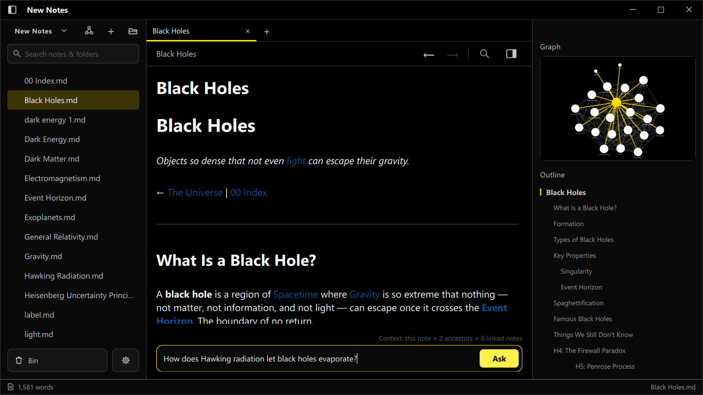
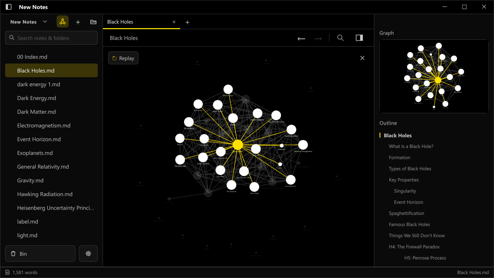
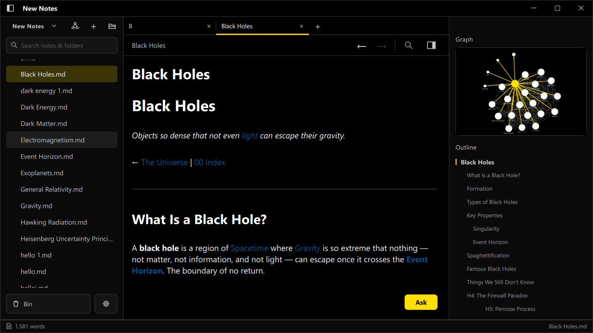

# HyperLinkNotes

**A local-first, networked note-taking app for Windows — a live force-directed
graph of your notes, an Obsidian-style live-preview Markdown editor, and an AI
assistant that actually understands your notebook.**

Built from scratch in native **C++ / Qt 6 / QML** — no Electron, no web view.

[](LICENSE)
[](https://www.qt.io)
[](#)
[](#)

---

## Screenshots

<p align="center">
  <br>
  <em>The live-preview editor, a graph of your notes, an outline, and the notebook-aware AI bar — the context line reads
  "this note + 2 ancestors + 8 linked notes".</em>
</p>

<p align="center">
  
  &nbsp;
  
</p>

---

## What it does

HyperLinkNotes stores everything as plain Markdown files in a folder you choose
(your "vault") — nothing is locked in a proprietary format, and it all works
offline. Notes link to each other with `[[wikilinks]]`, and those links power a
live graph you can explore.

### ✍️ Writing
- **Live-preview Markdown editor** — the line your cursor is on shows raw
  Markdown; every other line renders clean, Obsidian-style. No mode toggle.
- **`[[wikilinks]]`** to connect notes, and **multi-target links**
  `[[label|NoteA|NoteB]]` — one highlighted phrase pointing at several notes,
  with a hover preview card.
- **Branching** — highlight any text and split it into its own child note that
  remembers where it came from. This trail is what the AI follows (below).
- In-note search, an outline panel, and per-line virtualization so large notes
  stay smooth.

### 🕸️ The graph
- A **real-time, force-directed physics graph** of your whole vault —
  Barnes-Hut repulsion, spring links, and collision, simulated on a background
  thread at a fixed 60 Hz so the UI never stalls.
- Backlinks, neighbour highlighting, and a per-note mini-graph.

### 🤖 Notebook-aware AI
An **Ask-AI bar** answers questions about the note you're in — but the
interesting part is *what it knows*. Instead of blindly sending one note, it
assembles context from:
- the current note,
- every note it `[[links]]` to,
- the **entire branch chain it came from** (note Z still carries context from
  note A, without you re-explaining), and
- a map of every note title in the vault.

Distant ancestors are compressed to summaries so the context stays rich but
cheap even on deep chains, and stable context is cached between questions.
Provider-agnostic — bring your own key for **Anthropic, OpenAI, Google Gemini,
or any OpenAI-compatible endpoint**.

### 🎨 The app
- Local-first: your notes are just `.md` files on disk.
- Tabs, a file-tree sidebar, and a recycle bin.
- **8 built-in themes** (High Contrast, Light, Mist, Midnight Indigo, Emerald
  Noir, Crimson Ember, Cyber Teal, Sapphire).
- A custom frameless window with native-feeling caption controls.

---

## Download & install

Grab the latest build from the [**Releases**](https://github.com/akshay-env/Hyper-notes/releases) page:

| Download | For |
|---|---|
| **`HyperLinkNotes-Setup.exe`** | Normal install — Start-Menu + desktop shortcut, uninstaller. No admin needed. |
| **`HyperLinkNotes-…-portable.zip`** | No install — unzip anywhere and run `HyperLinkNotes.exe`. |

> **Note:** the app is not code-signed, so Windows SmartScreen may show a
> *"Windows protected your PC"* prompt on first run — click **More info →
> Run anyway**. This is expected for indie apps.

**AI is optional and bring-your-own-key.** The app works fully without it; to
enable the assistant, open Settings and paste an API key for your provider.
Keys are stored locally on your machine and never leave it except to call your
chosen provider.

---

## Build from source

Requires **Qt 6.11** (MinGW 64-bit) and CMake.

```bash
# Configure a release build
cmake -S . -B build/release -G "MinGW Makefiles" \
  -DCMAKE_BUILD_TYPE=Release \
  -DCMAKE_PREFIX_PATH="<path-to>/Qt/6.11.1/mingw_64"

# Build
cmake --build build/release -j
```

Or open `CMakeLists.txt` in **Qt Creator** and build with the MinGW kit.

To produce a distributable (bundled DLLs + portable ZIP), run
[`packaging/build_release.ps1`](packaging/README.md); to build the installer,
compile `packaging/installer.iss` with [Inno Setup](https://jrsoftware.org/isdl.php).

---

## Tech stack

- **C++17** application core — vault file operations, the graph physics
  simulation (on a `QThread` worker), and a provider-agnostic LLM client
  (`QNetworkAccessManager`, SSE streaming).
- **Qt 6 / QML** UI — a virtualized live-preview editor, a scene-graph edge
  renderer for the graph, and a theming singleton.
- **No web technologies** — the whole thing is compiled native; QML is baked
  into the binary at build time.

```
HyperLinkNotes/
├── src/            # C++: vault, physics, graph geometry, AI client
├── qml/            # QML UI + JS logic (editor, graph, sidebar, scripts)
├── packaging/      # Windows packaging (icon, installer, deploy script)
└── CMakeLists.txt
```

---

## License

HyperLinkNotes is released under the **Apache License 2.0** — see [`LICENSE`](LICENSE).

It is built with the **Qt framework**, used under the LGPLv3 and shipped as
dynamically-linked libraries — see [`NOTICE.md`](NOTICE.md) for attribution.
