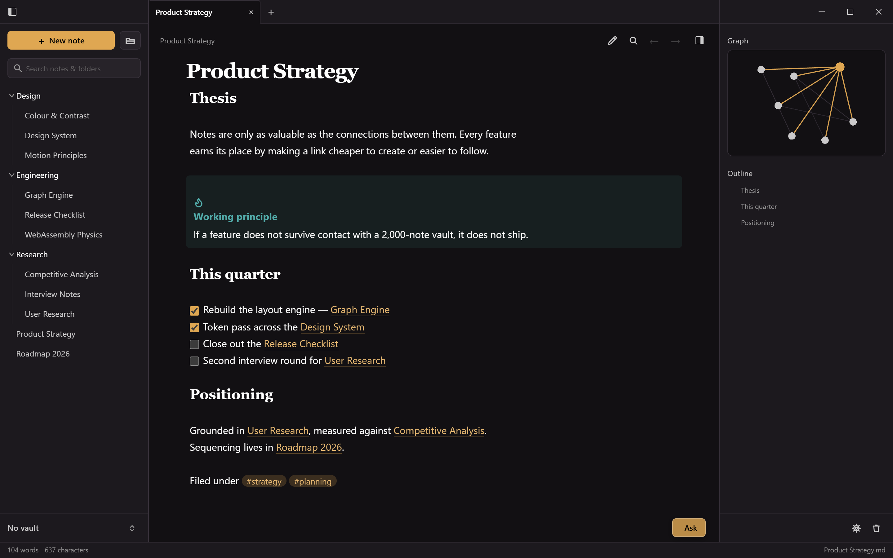
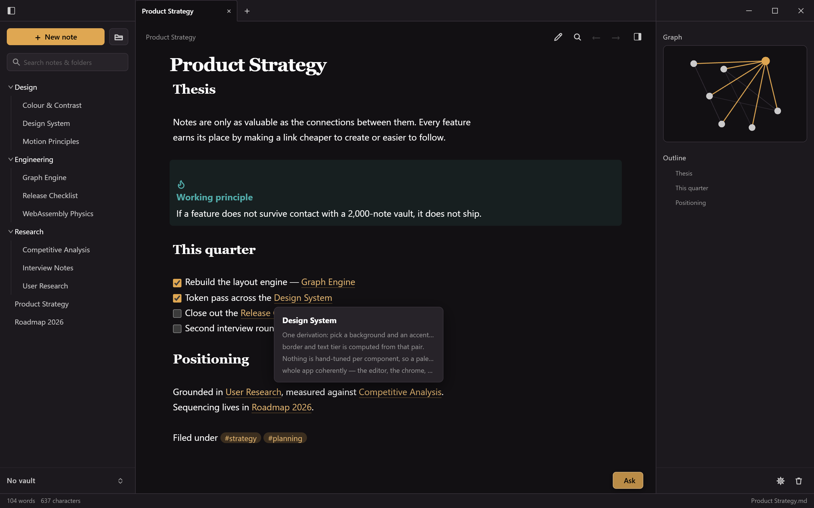
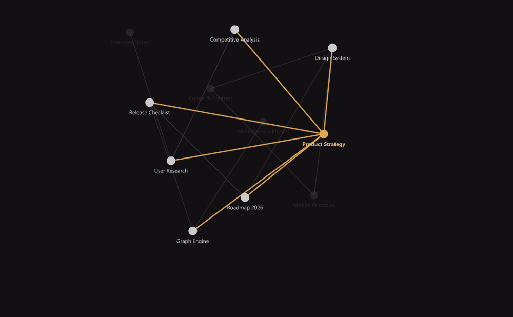
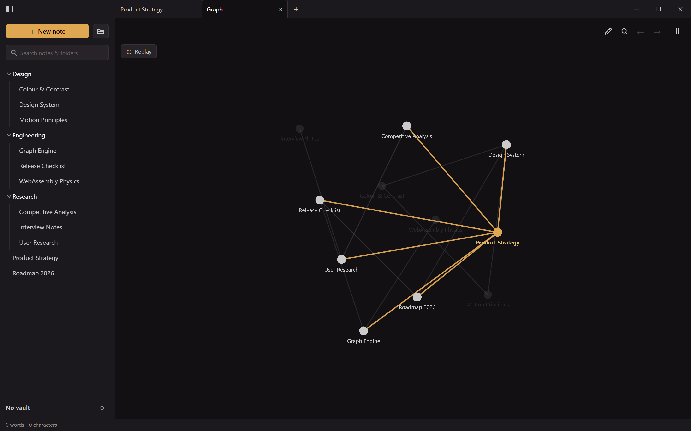
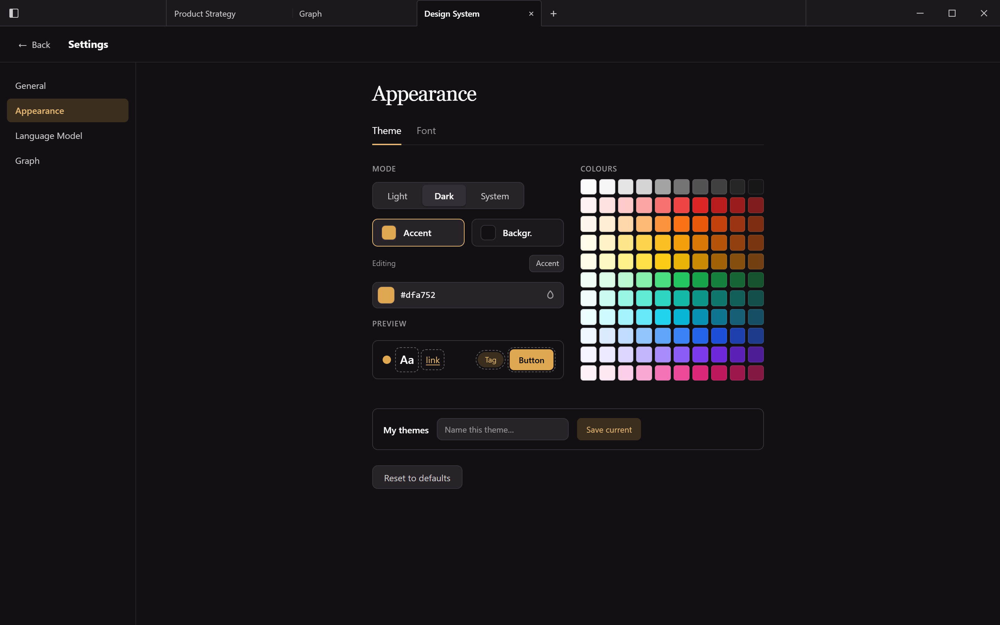
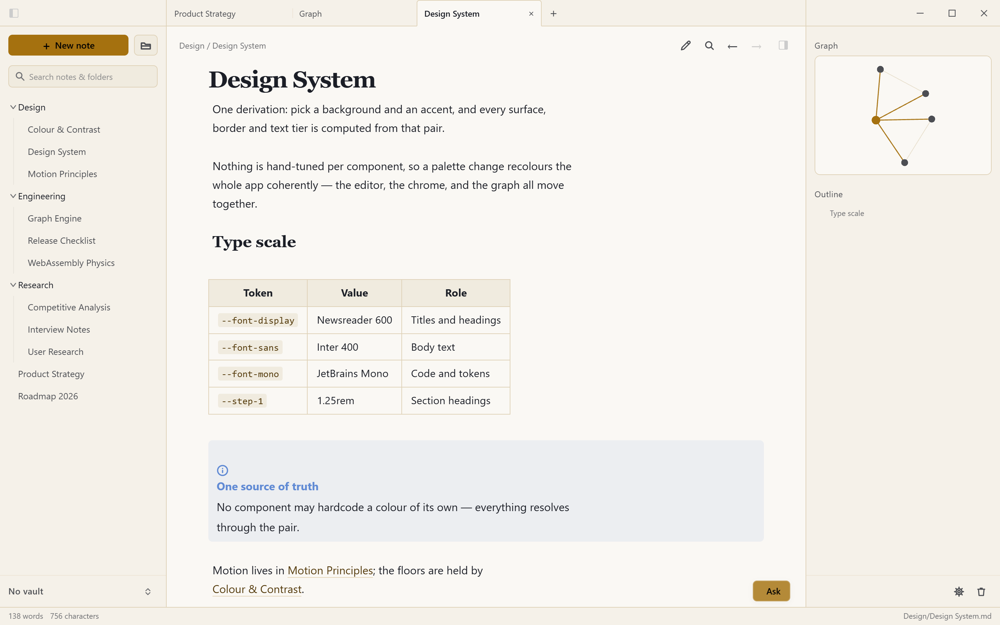
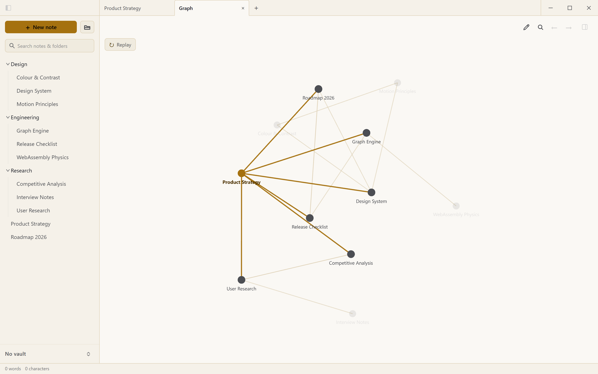

<div align="center">

# HyperLinkNotes

**A desktop app for writing notes in Markdown, with an AI assistant that reads them.**

Your notes are ordinary `.md` files in a folder on your computer. There is no account,
no sync service, and nothing leaves your machine unless you ask the assistant a question.

[](https://github.com/akshay-env/Hyper-notes/releases/latest)
[](LICENSE)



<sub>AI Q&amp;A over your notes · custom multi-provider LLM client in Rust · local-first, no cloud · Windows desktop app</sub>

</div>

---

## Contents

- [What it is](#what-it-is)
- [The AI assistant](#the-ai-assistant)
  - [Asking about one specific passage](#asking-about-one-specific-passage)
  - [What the model is shown](#what-the-model-is-shown)
  - [Where the model call happens](#where-the-model-call-happens)
  - [Choosing a provider and model](#choosing-a-provider-and-model)
  - [What it does not do](#what-it-does-not-do)
- [Notes and links](#notes-and-links)
- [The graph](#the-graph)
- [Themes](#themes)
- [Install](#install)
- [Getting started](#getting-started)
- [For developers](#for-developers)
- [Version history](#version-history)
- [Licence](#licence)

---

## What it is

Most note apps treat links as decoration. This one treats them as the main way you move
around: type `[[Design System]]` and the link works as you write it. Hover it to read the
other note without leaving this one. Click a link that points nowhere and the note is
created for you.

Everything you write stays on your disk as plain Markdown. You can open the same folder in
any other editor, back it up, or stop using this app entirely without losing anything.

The app is built for Windows and ships as a normal installer.

---

## The AI assistant

You can ask the assistant a question in two ways.

**Ask bar** (`Ctrl+K`) — the question and the answer are written into the note itself, so
you keep a permanent, editable record in the file. The answer types itself in at a speed
you choose, rather than appearing in uneven bursts as the network delivers it.

**Ask popup** (right-click a selection, or `Ctrl+Shift+A`) — the question is about exactly
the words you highlighted, and the answer appears in a small card without changing the
note. The highlighted words keep a faint dashed underline afterwards; hover it later and
the answer comes back. If you ask more than one question about the same passage, you get
tabs to move between the answers. You can turn any answer into its own note, and the
passage in the original note becomes a link to it.

Pressing `Esc` or **Stop** cancels the request in the backend, not just on screen.
Switching to another note while an answer is still arriving is safe — the stream stops
rather than writing into the wrong file.

### Asking about one specific passage

This is the part of the assistant that took the most work, and it solves a problem that is
easy to miss.

Suppose the word "cell" appears twice in a note — once in a sentence about prisons and once
in a sentence about biology. You highlight the biology one and ask "what does this mean?"
The model receives your note as plain text. It has no idea which "cell" you meant, so it
hedges, covers both, or answers about the wrong one.

The obvious fix — send the character positions of your selection — does not work either.
The text sent to the model is not the text in your editor: notes get trimmed to fit a size
limit, and a note with a YAML header at the top is offset by the length of that header. The
positions no longer line up.

The app solves this by marking the exact words you selected in a way that survives all of
that — trimming, headers, and the note being far longer than what the model ever sees — so
it can always tell the model plainly which words the question is about. Long notes and
notes with a YAML header both work correctly as a result: before this, highlighting
something deep in a long note could fall outside what the model saw and silently vanish.

If the passage genuinely cannot be located — you edited the note while the popup was
open — the app says so instead of quietly answering about the wrong text.

**59 automated tests** pin this down; see
[Notes on the selection-anchoring implementation](#notes-on-the-selection-anchoring-implementation)
for how it actually works.

### What the model is shown

The assistant does not send your whole vault. For each question it assembles a bounded
amount of context from the note graph:

| Included | Limit |
| --- | --- |
| The current note | 12,000 characters |
| The highlighted passage, plus surrounding text | 4,000 characters, 400 either side |
| Notes this note links to | up to 8 notes, 2,500 characters each |
| Parent notes above this one | up to 2 notes, 8,000 characters total |

Two things follow from this. Unrelated notes elsewhere in your vault cannot influence an
answer. And because the assistant is given your own material, it can answer from your notes
rather than from general knowledge — the system prompt tells it to say plainly when your
notes do not cover something.

### Where the model call happens

API keys are stored in the operating system's credential vault — Windows Credential
Manager, macOS Keychain, or the Linux secret service — and **the interface can never read
one back**.

This isn't just a rule the app follows — there is no way to ask for a saved key back, only
to save or clear one. The key is looked up once, at the moment a question is sent, by the
part of the app you don't see.

Settings shows `•••• saved` with **Replace** and **Remove** — there is no reveal button,
because there is genuinely nothing to reveal. Every model request works the same way, for
every provider.

### Choosing a provider and model

Four options: **Anthropic**, **Gemini**, **OpenAI**, and **Custom** — any endpoint that
speaks the OpenAI chat format, which is how you point it at a local model server such as
Ollama or LM Studio.

Each provider keeps its own key and its own model, so you can hold two keys at once and
switch between them.

Saving a key verifies it immediately by asking the provider for its model list. You get
either `✓ Key verified — N models available`, with the available models as clickable
options, or a clear reason it failed — a rejected key reads differently from a connection
that's simply down, rather than lumping every failure into one generic error.

Web search is checked the same way. The app asks whether the model you chose supports it,
and the globe button in the Ask bar only appears if it does — so the toggle can never offer
something the request would then refuse.

### What it does not do

Being accurate about this matters more than sounding impressive.

- **It only draws on your own notes.** The current one, the ones it links to, and the ones
  above it — nothing is searched by meaning, and nothing elsewhere in your vault can sneak
  in. The same note gives the assistant the same starting material every time, regardless
  of what you ask.
- **It budgets by length, not by what the model can actually handle**, and it doesn't track
  what a question costs to run.
- **If a request fails or a provider is too busy, you'll see an error** rather than the app
  quietly retrying on its own.
- **There are no advanced controls** in the interface for shaping how an answer comes out.
- Each answer stops at roughly 1,500 words.

---

## Notes and links

Headings, task lists, callouts, tables, maths, tags and images render as you write, with
the raw Markdown always one cursor-move away. There are three modes: live preview, source,
and reading.

<div align="center">

</div>

A single link can point at more than one note. `[[Design System|Motion Principles]]` offers
both when you hover it, so you do not have to choose at the moment you are writing.

---

## The graph

Every note is a dot, every link a line between two dots. Related notes pull together and
unrelated ones drift apart, so clusters in your thinking become visible.

<div align="center">

<br><em>The layout settling — recorded live, not a rendered animation.</em>
</div>

The layout math runs separately from the rest of the app, so it never slows down your
typing. That's what keeps it smooth even with a couple of thousand notes, instead of
stuttering.

The graph is a tab rather than a pop-up window, so it sits alongside your notes. A smaller
version of it, showing just the current note's neighbours, stays in the side panel while
you write.

<div align="center">

</div>

---

## Themes

Pick a background and an accent colour, and every other colour in the app is worked out
from that pair — surfaces, borders, the four levels of text, and the graph.

<div align="center">

</div>

The risk with generated colours is that some combination makes text unreadable. So the
derivation is tested: the suite walks **220,943 background/accent combinations** and checks
that every colour still meets its minimum contrast ratio.

<div align="center">

| Light | Dark |
| :---: | :---: |
|  |  |
|  |  |

</div>

---

## Install

Download the latest Windows x64 installer from the
**[Releases page](https://github.com/akshay-env/Hyper-notes/releases/latest)**.

> [!NOTE]
> The app draws its interface using the Microsoft Edge **WebView2** runtime, which is
> already present on Windows 11 and current Windows 10. The installer fetches it if it is
> missing.

> [!IMPORTANT]
> Windows will show a SmartScreen warning the first time you run the installer — this is
> expected, not a red flag. Code-signing certificates cost several hundred dollars a year,
> and most small, independent open-source projects — this one included — don't carry one.
> Choose **More info → Run anyway** to continue.

---

## Getting started

After installing, here's how to get to a working setup.

**1. Open the app and choose a vault.** The first screen offers three options:
**Create new vault** (a fresh folder for your notes), **Open existing vault** (point it at a
folder you already have), or **Continue without a folder** (a scratch space held only in
memory, for trying the app — nothing is written to disk). A vault is just a folder, so you
can move it, back it up, or open it in another editor at any time.

**2. Turn on the AI assistant.** This step is optional — everything else in the app works
without it. Open **Settings → Language Model**, choose a provider (**Anthropic**, **Gemini**,
**OpenAI**, or **Custom** for any OpenAI-compatible endpoint, such as a local Ollama server),
paste an API key, and press **Save**.

The key is checked immediately. A working key shows **"✓ Key verified — N models
available"**, and every model it can reach appears right there as a clickable list — you
never have to know or type a model name. Pick one, and a second check runs on just that
model to see whether it supports web search (what Google calls "grounding" for Gemini):
**"✓ This model can search the web"**, or a plain note that it can't. The globe button in
the Ask bar only shows up once a model has actually passed that check.

**3. Ask something.** With a key saved, `Ctrl+K` opens the Ask bar, and right-click →
Ask on a selection (or `Ctrl+Shift+A`) opens the Ask popup. See
[The AI assistant](#the-ai-assistant) for what each one does.

> [!TIP]
> **Gemini currently has a free tier.** As of this writing, several Gemini models can be
> used through Google AI Studio at no cost — a good way to try the assistant before
> deciding on a paid provider. This is Google's policy, not this project's, and could change
> at any time, so check
> [Google's current pricing](https://ai.google.dev/gemini-api/docs/pricing) before relying
> on it. One more thing worth knowing: Google's free tier terms allow submitted content to
> be used to improve their products — worth factoring in, since your notes are part of what
> gets sent when you ask a question.

---

## For developers

### How it is built

| Layer | Choice | Why |
| --- | --- | --- |
| Shell | Rust + Tauri 2 | Native window, no bundled browser runtime |
| Interface | SolidJS | Fine-grained updates, no virtual DOM diff per keystroke |
| Editor | CodeMirror 6 | Live preview built as decorations over the real document |
| Graph layout | AssemblyScript → WebAssembly | The O(n²) repulsion pass, off the main thread |
| Graph drawing | PixiJS (WebGL) | Thousands of nodes without per-frame DOM work |
| Backend | Rust | Files, model calls, OS keychain |

### Notes on the selection-anchoring implementation

[`src/ai/selectionAnchor.ts`](src/ai/selectionAnchor.ts) is what makes
["Asking about one specific passage"](#asking-about-one-specific-passage) actually point at
the right words. Four steps:

1. The note is normalised — line endings unified, YAML header removed — and the selection
   offsets are corrected by the same amount, so they still point at the right words.
2. The selected passage is wrapped in two rare bracket characters (`⟦` and `⟧`) that will
   not appear in ordinary writing. Any that somehow do appear in your text are swapped for
   different brackets first, so there is exactly one marked span.
3. If the note is too long, the excerpt is cut to a window **centred on your selection**
   rather than taken from the top. Highlighting something 30,000 characters into a long
   note used to fall outside the size limit and disappear; now it does not.
4. The model is told, in the system prompt, that the marked span is the subject of the
   question and the surrounding text is only context.

**59 test assertions** cover repeated occurrences, notes with and without headers,
selections at the very start and end of a file, and text that already contains the marker
characters.

### Notes on the AI implementation

[`src-tauri/src/commands/llm.rs`](src-tauri/src/commands/llm.rs) is a hand-written
multi-provider streaming client — 701 lines, 8 unit tests, no vendor SDK. Three points are
worth reading the file for:

- **Three request shapes, one output contract.** Anthropic uses `/v1/messages` with its own
  headers and a top-level `system` field. Gemini with web search uses its native
  `streamGenerateContent` endpoint. Everything else — OpenAI, Gemini without search, and
  any custom base URL — uses `/chat/completions`. All three paths emit the same two events
  to the interface, so nothing above this layer knows which provider answered.
- **Server-sent events are reassembled from raw bytes.** Network chunks routinely split a
  JSON frame down the middle, so incomplete trailing lines are held back until the rest
  arrives. Getting this wrong corrupts frames quietly instead of failing loudly, so the
  reassembly is a separate testable function — including a test asserting that an escaped
  `\n` *inside* a JSON string is not mistaken for a frame boundary.
- **Anthropic's paused turns are resumed.** When server-side web search hits its internal
  iteration cap, the turn ends with `stop_reason: "pause_turn"` and the client must send the
  entire assistant turn back verbatim to continue. That turn only ever existed as a stream
  of deltas, so it is rebuilt block by block as it arrives — tool-call arguments accumulated
  until the block closes, out-of-order block indices padded — then replayed. Up to four
  continuations.

There is also a failure this catches that nothing else would: if web search fails *inside* a
successful response, the HTTP status is still `200` and the model keeps generating. Left
alone, the answer would quietly proceed ungrounded, so that case is detected in the stream
and surfaced.

This deliberately is not Retrieval-Augmented Generation: there is no embedding model, vector
index, or similarity search anywhere in the codebase. Context comes from the fixed one-hop
graph walk described earlier instead, budgeted in characters rather than tokens.
`MAX_TOKENS = 2048` caps every response the same way across all three providers. There is no
configured request timeout, retry, or backoff — a hung connection or a rate limit surfaces
as an error rather than retrying automatically — and no sampling parameters (temperature,
top-p, seed) are exposed anywhere in the interface.

### Notes on API key handling

The frontend has no way to read a stored key back.
[`src/backend/keysApi.ts`](src/backend/keysApi.ts) exposes only `setApiKey`, `hasApiKey`,
`clearApiKey`, and a one-time migration helper — there is no getter, by design. The request
type the interface sends to the backend has no key field at all; the backend resolves the
key itself, in-process, at each of the three call sites that need it (asking a question,
listing models, checking web-search support). Keys are held by the `keyring` crate across
three OS backends: Windows Credential Manager, macOS Keychain, and the Linux secret service.

A side effect of making every model call from the backend rather than the interface: no
provider needs to support cross-origin requests, since none of this is a browser request.

### Build from source

Requires [Node.js](https://nodejs.org) 18+, the [Rust toolchain](https://rustup.rs), and
Tauri's [Windows prerequisites](https://tauri.app/start/prerequisites/) (MSVC build tools
and the WebView2 SDK).

```bash
npm install
npm run tauri dev      # run the desktop app
npm run tauri build    # produce the Windows installers
```

```bash
npm run dev            # interface only, in a browser at :1420
npm test               # graph, theme contrast and selection-anchor suites
npm run asbuild        # recompile the physics kernel to wasm
```

> [!TIP]
> Releases are built by CI, not locally — push a `v*` tag and
> [the workflow](.github/workflows/release.yml) produces the installer. Windows Smart App
> Control blocks Cargo from running the unsigned build scripts it compiles, which makes a
> local release build fail on machines that enforce it.

### Project layout

```
src/                 SolidJS interface
  ai/                Context assembly, selection anchoring, answer streaming
  components/        Sidebar, tabs, panels, dialogs, settings
  editor/            CodeMirror setup, live preview, wikilinks, callouts
  graph/             Graph data, physics (JS + wasm), Pixi renderer
  theme/             Design tokens, colour engine, motion
  state/             Signals — vault, tabs, UI, theme, settings
src-tauri/           Rust backend — files, LLM calls, keychain
assembly/            AssemblyScript source for the physics kernel
```

### Other decisions worth calling out

- **The physics kernel has two implementations.** WebAssembly is the fast path; JavaScript
  is the fallback. The test suite asserts the two agree, so the fallback cannot silently rot.
- **Tailwind owns geometry, not colour.** Utilities handle flex, grid and spacing; every
  colour resolves through the app's own tokens, so no utility can bypass the contrast floor.
- **Motion has one vocabulary.** Three durations, one easing curve, no overshoot — and
  `prefers-reduced-motion` removes all of it.

---

## Version history

**v2** is a ground-up rebuild on Rust, Tauri and SolidJS.

**v1** was a native C++ / Qt 6 / QML application — a different implementation of the same
idea. It remains on the
[`qt-legacy`](https://github.com/akshay-env/Hyper-notes/tree/qt-legacy) branch and under the
[`v1.0.0`](https://github.com/akshay-env/Hyper-notes/releases/tag/v1.0.0) tag.

---

## Licence

Apache 2.0 — see [LICENSE](LICENSE). Third-party components are listed in
[NOTICE.md](NOTICE.md).
